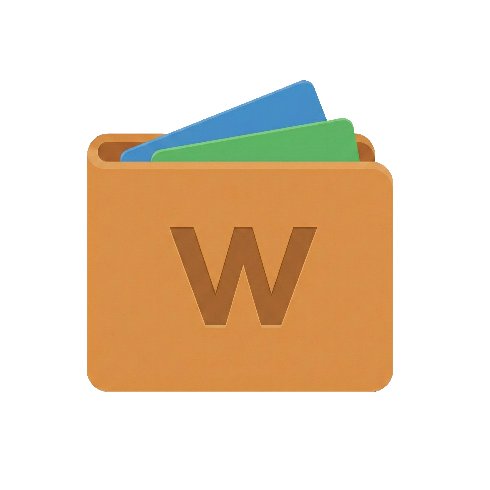

<p align="center">
    
</p>
<h1 align="center">Worth</h1>
<p align="center">
A balance tracking desktop app, made with <a href="https://v2.tauri.app">Tauri 2</a>, <a href="https://nuxt.com">Nuxt 4</a>, and <a href="https://ui.nuxt.com/">Nuxt UI 4</a>.
</p>

> [!IMPORTANT]
> Worth is currently in active development. There are no packaged releases to download yet, but it is in a working state if you are willing to build it from source. I am not guaranteeing backwards compatibility until Worth has a proper release.

## What is Worth?

Worth is a small desktop app for tracking account balances over time.

I built Worth because, for a long time, I have kept track of my own balances in a spreadsheet. That worked well enough, but only in the particular way that a spreadsheet can: extremely capable, occasionally uncooperative, and all too willing to turn a simple allocation chart into most of an evening.

There are already plenty of apps for managing your finances. Many of them will track every transaction, categorise every coffee, warn you about subscriptions, and generally encourage you to develop a close personal relationship with your outgoings. I did not want to build another one of those. I wanted something more interested in the bigger picture: a high-level view of your finances over time.

Worth does not track transactions. It tracks **snapshots**: the balance of an account at a particular point in time. A snapshot does not need a merchant, a category, or a tiny icon of a sandwich. When an account’s value changes, or whenever you feel like updating it, Worth records the balance for that date.

Worth is local-first: your financial data lives on your machine, in a SQLite database. You do not need an account to use it either, because quite frankly I don't want to send you weekly emails detailing the “top 3 trading platforms this week”, complete with affiliate links. Nor do I wish to sell your data to a small ecosystem of data brokers, ad networks, and other people who use the word “insights” entirely too frequently.

Mostly, I wanted a better version of the system I was already using. I hope it ends up being useful to other people too.

— Callum

## Analytics and privacy

Worth is local-first, but it does use PostHog for basic, anonymous product analytics and feedback. You can turn analytics off at any time in Settings.

I use this to understand which features are being used, whether bugs or crashes are happening, and to support the feedback button inside the app. I do not use it to collect personal financial data.

Worth does not send account names, balances, institution names, or anything else that describes you or your finances. Events are strictly limited to basic app activity, such as when an institution is created or if the app crashes. IP addresses are never collected, and analytics events are anonymous.

The goal is to help me make Worth better without turning it into the sort of app I have already spent several paragraphs complaining about.

## Technologies

- Nuxt v4
- Tauri v2
- Nuxt UI v4
- TailwindCSS v4
- TypeScript
- ESLint
- TanStack Query
- Apache ECharts
- SQLite
- PostHog

## Prerequisites

- Install [Node](https://nodejs.org) v24.
- Install [Tauri prerequisites](https://tauri.app/start/prerequisites).
- Install [Bun](https://bun.sh).

## Commands

### Dev
Start the project for development.

```sh
# install dependencies
$ bun install

# start the project
$ bun run tauri:dev

# lint
$ bun run lint:ts
$ bun run lint:ts:fix
$ bun run lint:rust
$ bun run lint:rust:fix
$ bun run lint:all
$ bun run lint:all:fix

# typecheck
$ bun run check:ts
$ bun run check:rust
$ bun run check:all

# regenerate Rust-first contracts
$ bun run contracts:gen

# database CLI
$ bun run db
```

### Rust contract generation

Rust is the source of truth for API contract types and validation metadata used for form generation:

- Rust command signatures/types generate `app/generated/bindings.ts`.
- Rust JSON schemas are exported to `app/generated/schemas/*.schema.json`.
- JSON schemas are converted to Zod schemas in `app/generated/zod/*.ts`.

Use `bun run contracts:gen` to regenerate all generated files (bindings, schemas, zod).

### Build
Generate the Nuxt static output and bundle the project under `src-tauri/target`.

```sh
$ bun run tauri:build
```

### Debug
Generate the Nuxt static output with the ability to open the console and bundle the project under `src-tauri/target`.

```sh
$ bun run tauri:build:debug
```

### Bump version number
Use the `bumpp` interactive CLI to bump version numbers

```sh
$ bun run bump
```

## Terminology
- **Institution**: A provider that groups related accounts together, e.g. a bank, broker, credit card company, or pension provider.
- **Account**: A financial account held at an institution, e.g. a current account, savings account, ISA, pension, credit card, or loan.
- **Snapshot**: A recorded account balance on a specific date.
